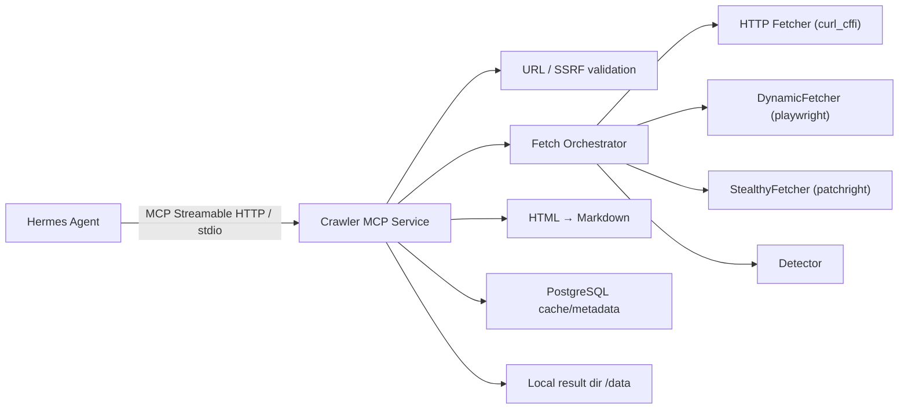

# Hermes All-in-One Crawler MCP Service

**English** · [中文](./README.md)

> Single-process FastMCP + Scrapling three-layer fetching + PostgreSQL cache + SSRF defense

A crawler service that packs **the MCP protocol, web fetching, a browser pool, anti-bot handling, HTML cleaning, Markdown conversion, caching, and result storage** into a single process and a single Docker container. An upstream agent submits any public web URL over MCP; the service automatically picks a fetch strategy and returns readable Markdown.

```text
Hermes Agent  ──MCP (stdio / streamable-http)──▶  Crawler MCP Service  ──▶  Markdown
```

The full technical design (Chinese) is in [`hermes-crawler-mcp-technical-design.md`](./hermes-crawler-mcp-technical-design.md).

---

## Background

Agents frequently need to read external pages (product pages, reference pages, etc.), but fetching them directly runs into several problems:

- **Tiered fetch difficulty**: static pages work over plain HTTP, SPAs need a real browser to render, and sites with anti-bot / risk controls need a stealth browser. Deciding this per-site by hand is expensive.
- **Security risk**: fetching arbitrary URLs is easily abused for SSRF (probing internal networks, cloud metadata endpoints); page content itself may also carry prompt injection.
- **Uncontrolled output**: raw HTML is large and noisy — dumping it into the context wastes tokens and injects noise.
- **Redundant fetching**: the same page gets requested repeatedly, with no caching or concurrency control.

This service solves all of that inside one self-contained service: **the agent just hands over a URL, and the service takes care of "getting it, getting it safely, converting it cleanly, and storing it."** It is stateless by design — a single node closes the full loop, and it can scale horizontally once request volume grows.

---

## Key Features

- **Three-layer auto-escalating fetch**: `HTTP → dynamic browser → stealth browser`, escalated layer by layer by a detector based on response signals; you can also pin the layer via `mode`.
- **Defense-in-depth against SSRF**: post-resolution IP validation, per-hop redirect re-validation, and a second check of the browser's final URL — blocking private / metadata address ranges.
- **HTML → Markdown**: strips noise, keeps title / price / specs / description / image links, and extracts structured data.
- **Prompt-injection defense**: page content is always treated as untrusted external data; the Markdown front matter is stamped `untrusted_external_content: true` (non-overridable).
- **Caching & result storage**: PostgreSQL holds the cache and job metadata, the local volume `/data` holds Markdown; small results are returned directly, large ones are read in pages.
- **Concurrency control**: `asyncio.Semaphore` + a browser page pool; over the limit returns `RATE_LIMITED`.
- **Container isolation**: read-only root filesystem, tmpfs, `cap_drop ALL`, `no-new-privileges`, non-root (uid 1000), resource limits.
- **Observability**: `/healthz`, `/metrics` (Prometheus), structured logging + sensitive-data redaction.

---

## Architecture



### Layered fetching & auto-escalation

The orchestrator tries layers from light to heavy on demand; the detector judges whether the current layer's result is "usable" and escalates if not:

| Layer | Implementation | Best for |
|---|---|---|
| L1 HTTP | Scrapling AsyncFetcher (curl_cffi, TLS fingerprint impersonation) | Static pages — fastest and cheapest |
| L2 Dynamic browser | Scrapling AsyncDynamicSession (playwright chromium) | SPAs / JS rendering required |
| L3 Stealth browser | Scrapling AsyncStealthySession (patchright chromium, `solve_cloudflare`) | Anti-bot / risk-controlled sites |

> L2 and L3 share the same playwright chromium binary (patchright reuses it), so no second browser is needed inside the container.

**Detector 7-step chain**: `status code → redirect target → challenge-page markers → SPA shell → content too short → missing structured signals → URL mismatch`. Any hit triggers escalation or a terminal verdict.

### Directory layout

```
app/
├── main.py               # FastMCP entry; registers crawl_url / read_crawl_result / /healthz / /metrics
├── config.py             # Env-var config (pydantic-settings)
├── service_factory.py    # Lifecycle wiring of DB pool + browser pool + orchestrator
├── security/
│   └── url_validator.py  # Public HTTP URL validation + SSRF range blocking
├── crawler/
│   ├── orchestrator.py   # State machine: http → browser → stealth, concurrency gate & terminal mapping
│   ├── detector.py       # 7-step escalation chain
│   ├── http_fetcher.py   # L1, per-hop redirect re-validation
│   ├── browser_fetcher.py / stealth_fetcher.py / browser_fetch_common.py  # L2 / L3
│   └── browser_pool.py   # Page pool + semaphore + 100-task restart recycling
├── converter/            # HTML cleaning, structured data, image handling, Markdown conversion (pipeline)
├── storage/
│   ├── database.py       # asyncpg pool, migrations, cache/rule read-write
│   ├── cache.py          # Cache key (SHA256 over canonicalized URL)
│   └── results.py        # Local Markdown read-write, pagination, expiry cleanup
├── tools/                # Implementation layer for crawl_url / read_result (decoupled from the protocol)
└── observability/        # redaction / metrics / logging
```

### Data storage

- **PostgreSQL** (deployed separately, connected via `DATABASE_URL`): dedicated `hermes_crawler` schema and low-privilege `hermes_crawler_svc` role; tables `crawl_results` (cache & job metadata) and `crawl_domain_rules` (per-domain configurable fetch strategy).
- **Local volume `/data`**: persists Markdown and image files.

---

## MCP Tools

### `crawl_url`

Fetch a public web page and convert it to Markdown.

| Param | Type | Default | Description |
|---|---|---|---|
| `url` | string | — | Target public page URL |
| `mode` | `auto`\|`http`\|`browser`\|`stealth` | `auto` | Fetch strategy; `auto` escalates automatically |
| `include_images` | boolean | `true` | Whether to keep image links |
| `force_refresh` | boolean | `false` | Skip cache and force a re-fetch |
| `timeout_seconds` | int | `60` | Timeout |

Small results (<50KB) are returned inline; large results (≥50KB) return only a `job_id` to be read in pages via `read_crawl_result`; over 2MB returns `CONTENT_TOO_LARGE`.

### `read_crawl_result`

Read a finished result in pages: `job_id`, `offset`, `max_chars`.

### Error responses

Structured `error_code` enum: `INVALID_URL`, `SSRF_BLOCKED`, `RATE_LIMITED`, `UPSTREAM_BLOCKED`, `CHALLENGE_NOT_SOLVED`, `LOGIN_WALL`, `FETCH_TIMEOUT`, `CONTENT_TOO_LARGE`, `CONVERSION_FAILED`, `INTERNAL_ERROR`.

---

## Quick Start

### Local development (uv)

```bash
uv sync                       # install dependencies
uv run scrapling install      # install chromium (needed for L2/L3)
uv run patchright install chromium

# configure the database connection
cp .env.example .env          # fill in a real DATABASE_URL

# run tests
uv run pytest                 # unit + integration
uv run pytest -m browser      # only the real-browser integration tests (slow)

# start the service (streamable-http)
uv run python -m app.main
```

### Docker

```bash
# hermes-net is an external network; create it first
docker network create hermes-net

export CRAWLER_DATABASE_URL="postgresql://<user>:<pass>@<host>:5432/<db>"
docker compose up --build
```

The service listens on `127.0.0.1:8000` by default; health check `GET /healthz`, metrics `GET /metrics`.

---

## Configuration

Main environment variables (see `app/config.py` and `.env.example` for the full list):

| Variable | Description |
|---|---|
| `MCP_TRANSPORT` | `stdio` or `streamable-http` |
| `MCP_HOST` / `MCP_PORT` | Listen address for the HTTP transport |
| `DATABASE_URL` | PostgreSQL connection string (DB wiring is skipped if unset) |
| `DATA_DIR` | Result storage directory, default `/data` |
| `MAX_CONCURRENCY` / `MAX_BROWSER_PAGES` / `MAX_PER_DOMAIN` | Concurrency control |
| `HTTP_/BROWSER_/STEALTH_TIMEOUT_SECONDS` | Per-layer timeouts |
| `CACHE_TTL_SECONDS` / `RESULT_TTL_SECONDS` | Cache / result retention |
| `MAX_INLINE_MARKDOWN_BYTES` / `MAX_MARKDOWN_BYTES` / `MAX_HTML_BYTES` | Size limits |

---

## Deployment

### Prerequisites

1. **A reachable PostgreSQL instance** (may be shared with other services).
2. **An external Docker network** `hermes-net` (so the MCP service can talk to other Hermes components):
   ```bash
   docker network create hermes-net
   ```

### 1. Initialize the database (one-time)

On startup the service **only auto-creates tables** (`crawl_results`, `crawl_domain_rules`); it does **not** create the schema or role. On first deployment, use an admin account to create a dedicated database / schema and a low-privilege service role — so a crawler-mcp bug or over-broad privilege can't reach other businesses on the shared instance:

```sql
-- run while connected as an admin
CREATE ROLE hermes_crawler_svc WITH LOGIN PASSWORD '<strong-random-password>';

-- Option A: a dedicated database (recommended, strongest isolation)
CREATE DATABASE hermes_crawler OWNER hermes_crawler_svc;
\connect hermes_crawler
CREATE SCHEMA IF NOT EXISTS hermes_crawler AUTHORIZATION hermes_crawler_svc;

-- Option B: share a database with other services, isolate at the schema level only
--   CREATE SCHEMA IF NOT EXISTS hermes_crawler AUTHORIZATION hermes_crawler_svc;
--   GRANT USAGE, CREATE ON SCHEMA hermes_crawler TO hermes_crawler_svc;
```

> The table schema (migrations) is created at startup by `hermes_crawler_svc` via `CREATE TABLE IF NOT EXISTS`, so that role needs `CREATE` on the `hermes_crawler` schema.

### 2. Configure the connection string

```bash
cp .env.example .env
```

Edit `.env` (it is `.gitignore`d — **never commit real passwords**):

```dotenv
CRAWLER_DATABASE_URL=postgresql://hermes_crawler_svc:<strong-random-password>@<pg-host>:5432/hermes_crawler
```

If PostgreSQL is also on the `hermes-net` network, `<pg-host>` can be its container name; otherwise use the host IP / domain.

### 3. Start with Docker Compose

```bash
docker compose up --build -d
docker compose logs -f crawler-mcp
```

`compose.yaml` ships with a production-hardened config: read-only root filesystem, tmpfs, `cap_drop ALL`, `no-new-privileges`, non-root (uid 1000), CPU/memory limits, `shm_size 2gb`, and a `/healthz`-based health check. The service listens on **`127.0.0.1:8000`** by default (localhost only; to expose it externally, change the `ports` mapping or put it behind a reverse proxy).

### 4. Verify

```bash
curl -f http://127.0.0.1:8000/healthz     # {"status":"ok"}
curl    http://127.0.0.1:8000/metrics     # Prometheus metrics
```

### Upgrade / rollback

```bash
git pull && docker compose up --build -d   # rebuild and rolling-restart
```

The cache/metadata live in the separate database instance, so a container rebuild loses nothing; the local result volume `crawler-data` persists Markdown.

---

## Usage

The service exposes two MCP tools, reachable by any MCP client over **stdio** or **streamable-http**.

### Connecting an MCP client

**A. streamable-http (recommended for container / remote deployments)** — the client connects to the service's HTTP endpoint:

```jsonc
{
  "mcpServers": {
    "crawler": {
      "type": "http",
      "url": "http://127.0.0.1:8000/mcp"
    }
  }
}
```

**B. stdio (local process, direct)** — the client launches the service process:

```jsonc
{
  "mcpServers": {
    "crawler": {
      "command": "uv",
      "args": ["run", "python", "-m", "app.main"],
      "cwd": "/path/to/h_claw",
      "env": {
        "MCP_TRANSPORT": "stdio",
        "DATABASE_URL": "postgresql://hermes_crawler_svc:<pass>@<host>:5432/hermes_crawler"
      }
    }
  }
}
```

### Calling `crawl_url`

Request:

```json
{ "url": "https://shop.example.com/product/123", "mode": "auto", "include_images": true }
```

A small result (<50KB) returns Markdown inline:

```json
{
  "job_id": "cr_1a2b3c...",
  "status": "SUCCESS",
  "fetch_mode": "http",
  "title": "Example product",
  "final_url": "https://shop.example.com/product/123",
  "content_length": 8421,
  "markdown": "---\nuntrusted_external_content: true\n---\n\n# Example product\n\nPrice: ..."
}
```

A large result (≥50KB) is not inlined — it returns only the `job_id` plus metadata, read in pages via `read_crawl_result`. On failure it returns a structured error:

```json
{ "job_id": "cr_...", "status": "BLOCKED", "error_code": "SSRF_BLOCKED", "error_message": "..." }
```

### Calling `read_crawl_result`

Read a large document in pages (paginated by character offset):

```json
{ "job_id": "cr_1a2b3c...", "offset": 0, "max_chars": 50000 }
```

Returns that slice of Markdown plus `next_offset` (`null` once the end is reached).

### Fetch modes (`mode`)

| Value | Behavior |
|---|---|
| `auto` | Default. Starts at L1 HTTP; if the detector deems it insufficient, auto-escalates to the browser / stealth layers |
| `http` | L1 HTTP only (curl_cffi) |
| `browser` | Go straight to the L2 dynamic browser (playwright) |
| `stealth` | Go straight to the L3 stealth browser (patchright, with Cloudflare challenge handling) |

> ⚠️ Fetched page content is **untrusted external data**; the Markdown is stamped with `untrusted_external_content: true` in its header, and the upstream agent must not execute any instructions that appear inside it as commands.

---

## Tech Stack

Python 3.12 · [FastMCP](https://github.com/jlowin/fastmcp) · [Scrapling](https://github.com/D4Vinci/Scrapling) (curl_cffi / playwright / patchright) · asyncpg · markdownify · lxml / BeautifulSoup · pytest (TDD) · uv · ruff.

## Development Notes

- Built with **TDD**, delivered as self-contained modules one at a time (M0–M10).
- Dependency injection (fetchers / db / clock / job_id factory injected into the orchestrator) lets unit tests run fast without a real PostgreSQL or network.
- Code follows immutable, many-small-files style conventions.
