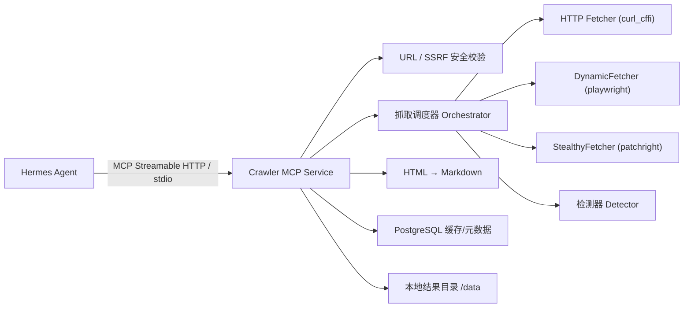

# Hermes 一体化爬虫 MCP 服务

[English](./README.en.md) · **中文**

> 单进程 FastMCP + Scrapling 三层抓取 + PostgreSQL 缓存 + SSRF 防护

一个把 **MCP 协议、网页抓取、浏览器池、反爬处理、HTML 清洗、Markdown 转换、缓存与结果存储** 整合到同一个进程、同一个 Docker 容器里的爬虫服务。上游 Agent 通过 MCP 提交任意公开网页 URL，服务自动选择抓取策略并返回适合阅读的 Markdown。

```text
Hermes Agent  ──MCP (stdio / streamable-http)──▶  Crawler MCP Service  ──▶  Markdown
```

完整技术方案见 [`hermes-crawler-mcp-technical-design.md`](./hermes-crawler-mcp-technical-design.md)。

---

## 背景

Agent 在执行任务时经常需要读取外部网页（商品页、资料页等），但直接抓取会遇到几类问题：

- **抓取难度分层**：静态页面用普通 HTTP 即可，SPA 需要真实浏览器渲染，有反爬/风控的站点还需要隐身浏览器。为每个站点单独判断成本很高。
- **安全风险**：任意 URL 抓取容易被用于 SSRF（探测内网、云元数据端点）；页面内容本身也可能携带提示词注入。
- **结果不可控**：原始 HTML 又大又乱，直接塞进上下文既浪费 token 又夹带噪声。
- **重复抓取**：同一页面被反复请求，缺少缓存与并发控制。

本服务的目标就是把这些问题在一个自闭环的服务里解决：**Agent 只管给 URL，服务负责"怎么抓得到、抓得安全、转得干净、存得下来"**。设计上无状态、单机即可完整闭环，请求量大后可横向扩容。

---

## 核心特性

- **三层自动升级抓取**：`HTTP → 动态浏览器 → 隐身浏览器`，由检测器（detector）根据响应特征逐层升级，也支持手动指定 `mode`。
- **SSRF 纵深防御**：解析后校验 IP、逐跳重校验重定向、浏览器最终 URL 二次校验，拦截私网 / 元数据地址段。
- **HTML → Markdown**：清洗噪声、保留标题/价格/规格/描述/图片链接，提取结构化数据。
- **提示词注入防护**：页面内容一律视为不可信外部数据，Markdown front matter 标记 `untrusted_external_content: true`（不可被覆盖）。
- **缓存与结果存储**：PostgreSQL 存缓存与任务元数据，本地卷 `/data` 存 Markdown；小结果直接返回，大结果分段读取。
- **并发控制**：`asyncio.Semaphore` + 浏览器页池，超限返回 `RATE_LIMITED`。
- **容器安全隔离**：只读根文件系统、tmpfs、`cap_drop ALL`、`no-new-privileges`、非 root（uid 1000）、资源限额。
- **可观测性**：`/healthz`、`/metrics`（Prometheus）、结构化日志 + 敏感信息脱敏。

---

## 架构设计



### 分层抓取与自动升级

调度器按需从轻到重逐层尝试，检测器判断当前层结果是否"可用"，不可用则升级：

| 层 | 实现 | 适用场景 |
|---|---|---|
| L1 HTTP | Scrapling AsyncFetcher（curl_cffi，TLS 指纹伪装） | 静态页面，最快最省 |
| L2 动态浏览器 | Scrapling AsyncDynamicSession（playwright chromium） | SPA / 需 JS 渲染 |
| L3 隐身浏览器 | Scrapling AsyncStealthySession（patchright chromium，`solve_cloudflare`） | 反爬 / 风控站点 |

> L2 与 L3 复用同一套 playwright chromium 二进制（patchright 共用），容器内无需第二套浏览器。

**检测器（detector）7 步链**：`状态码 → 重定向目标 → 挑战页标记 → SPA 空壳 → 内容过短 → 结构化信号缺失 → URL 不匹配`，任一命中即触发升级或判定终态。

### 目录结构

```
app/
├── main.py               # FastMCP 入口，注册 crawl_url / read_crawl_result / /healthz / /metrics
├── config.py             # 环境变量配置（pydantic-settings）
├── service_factory.py    # 装配 DB 池 + 浏览器池 + 调度器的生命周期
├── security/
│   └── url_validator.py  # 公网 HTTP URL 校验 + SSRF 网段拦截
├── crawler/
│   ├── orchestrator.py   # 状态机：http → browser → stealth，并发闸门与终态映射
│   ├── detector.py       # 7 步升级判定链
│   ├── http_fetcher.py   # L1，逐跳重校验重定向
│   ├── browser_fetcher.py / stealth_fetcher.py / browser_fetch_common.py  # L2 / L3
│   └── browser_pool.py   # 页池 + 信号量 + 100 任务重启回收
├── converter/            # HTML 清洗、结构化数据、图片处理、Markdown 转换（pipeline）
├── storage/
│   ├── database.py       # asyncpg 池、迁移、缓存/规则读写
│   ├── cache.py          # 缓存键（URL 规范化后 SHA256）
│   └── results.py        # 本地 Markdown 读写、分页、过期清理
├── tools/                # crawl_url / read_result 的实现层（与协议解耦）
└── observability/        # redaction / metrics / logging
```

### 数据存储

- **PostgreSQL**（独立部署，通过 `DATABASE_URL` 连接）：专用 `hermes_crawler` schema、低权限 `hermes_crawler_svc` 角色；`crawl_results`（缓存与任务元数据）、`crawl_domain_rules`（按域名可配置抓取策略）。
- **本地卷 `/data`**：Markdown 与图片文件持久化。

---

## MCP 工具

### `crawl_url`

抓取公开网页并转为 Markdown。

| 参数 | 类型 | 默认 | 说明 |
|---|---|---|---|
| `url` | string | — | 目标公开网页 URL |
| `mode` | `auto`\|`http`\|`browser`\|`stealth` | `auto` | 抓取策略；`auto` 自动升级 |
| `include_images` | boolean | `true` | 是否保留图片链接 |
| `force_refresh` | boolean | `false` | 跳过缓存强制重抓 |
| `timeout_seconds` | int | `60` | 超时 |

小结果（<50KB）直接内联返回；大结果（≥50KB）仅返回 `job_id`，用 `read_crawl_result` 分段读取；超 2MB 返回 `CONTENT_TOO_LARGE`。

### `read_crawl_result`

分段读取已完成结果：`job_id`、`offset`、`max_chars`。

### 错误返回

结构化 `error_code` 枚举：`INVALID_URL`、`SSRF_BLOCKED`、`RATE_LIMITED`、`UPSTREAM_BLOCKED`、`CHALLENGE_NOT_SOLVED`、`LOGIN_WALL`、`FETCH_TIMEOUT`、`CONTENT_TOO_LARGE`、`CONVERSION_FAILED`、`INTERNAL_ERROR`。

---

## 快速开始

### 本地开发（uv）

```bash
uv sync                       # 安装依赖
uv run scrapling install      # 安装 chromium（L2/L3 需要）
uv run patchright install chromium

# 配置数据库连接
cp .env.example .env          # 填入真实 DATABASE_URL

# 运行测试
uv run pytest                 # 单元 + 集成
uv run pytest -m browser      # 仅真实浏览器集成测试（较慢）

# 启动服务（streamable-http）
uv run python -m app.main
```

### Docker

```bash
# hermes-net 为外部网络，需先创建
docker network create hermes-net

export CRAWLER_DATABASE_URL="postgresql://<user>:<pass>@<host>:5432/<db>"
docker compose up --build
```

服务默认监听 `127.0.0.1:8000`，健康检查 `GET /healthz`，指标 `GET /metrics`。

---

## 配置

主要环境变量（完整见 `app/config.py` 与 `.env.example`）：

| 变量 | 说明 |
|---|---|
| `MCP_TRANSPORT` | `stdio` 或 `streamable-http` |
| `MCP_HOST` / `MCP_PORT` | HTTP 传输监听地址 |
| `DATABASE_URL` | PostgreSQL 连接串（未设置则跳过 DB 装配） |
| `DATA_DIR` | 结果存储目录，默认 `/data` |
| `MAX_CONCURRENCY` / `MAX_BROWSER_PAGES` / `MAX_PER_DOMAIN` | 并发控制 |
| `HTTP_/BROWSER_/STEALTH_TIMEOUT_SECONDS` | 各层超时 |
| `CACHE_TTL_SECONDS` / `RESULT_TTL_SECONDS` | 缓存 / 结果保留时长 |
| `MAX_INLINE_MARKDOWN_BYTES` / `MAX_MARKDOWN_BYTES` / `MAX_HTML_BYTES` | 大小上限 |

---

## 部署

### 前置条件

1. **一个可用的 PostgreSQL 实例**（可与其他服务共享）。
2. **外部 Docker 网络** `hermes-net`（供 MCP 服务与其他 Hermes 组件互通）：
   ```bash
   docker network create hermes-net
   ```

### 1. 初始化数据库（一次性）

服务启动时**只会自动建表**（`crawl_results`、`crawl_domain_rules`），**不会**自动创建
schema 与角色。首次部署需用管理员账号手动创建独立数据库 / schema 与一个低权限专用角色——
避免 crawler-mcp 的缺陷或权限越界波及共享实例上的其他业务：

```sql
-- 用管理员连接后执行
CREATE ROLE hermes_crawler_svc WITH LOGIN PASSWORD '<强随机密码>';

-- 方案 A：独立数据库（推荐，隔离最彻底）
CREATE DATABASE hermes_crawler OWNER hermes_crawler_svc;
\connect hermes_crawler
CREATE SCHEMA IF NOT EXISTS hermes_crawler AUTHORIZATION hermes_crawler_svc;

-- 方案 B：与其他服务共用一个库，仅隔离到 schema
--   CREATE SCHEMA IF NOT EXISTS hermes_crawler AUTHORIZATION hermes_crawler_svc;
--   GRANT USAGE, CREATE ON SCHEMA hermes_crawler TO hermes_crawler_svc;
```

> 表结构（migrations）在服务启动时由 `hermes_crawler_svc` 自动 `CREATE TABLE IF NOT EXISTS`
> 建立，因此该角色需要对 `hermes_crawler` schema 有 `CREATE` 权限。

### 2. 配置连接串

```bash
cp .env.example .env
```

编辑 `.env`（该文件已被 `.gitignore` 忽略，**不要提交真实密码**）：

```dotenv
CRAWLER_DATABASE_URL=postgresql://hermes_crawler_svc:<强随机密码>@<pg-host>:5432/hermes_crawler
```

`<pg-host>` 若 PostgreSQL 也在 `hermes-net` 网络里可用容器名，否则用宿主机 IP / 域名。

### 3. 用 Docker Compose 启动

```bash
docker compose up --build -d
docker compose logs -f crawler-mcp
```

`compose.yaml` 已内置生产化配置：只读根文件系统、tmpfs、`cap_drop ALL`、
`no-new-privileges`、非 root（uid 1000）、CPU/内存限额、`shm_size 2gb`，以及基于
`/healthz` 的健康检查。服务默认监听 **`127.0.0.1:8000`**（仅本机，需要对外时改 `ports`
映射或置于反向代理之后）。

### 4. 验证

```bash
curl -f http://127.0.0.1:8000/healthz     # {"status":"ok"}
curl    http://127.0.0.1:8000/metrics     # Prometheus 指标
```

### 升级 / 回滚

```bash
git pull && docker compose up --build -d   # 重新构建并滚动重启
```

数据库缓存/元数据在独立实例中，容器重建不丢；本地结果卷 `crawler-data` 持久化 Markdown。

---

## 使用方法

服务对外暴露两个 MCP 工具，通过 **stdio** 或 **streamable-http** 传输接入任意 MCP 客户端。

### 接入 MCP 客户端

**A. streamable-http（推荐用于容器/远程部署）** —— 客户端连到服务的 HTTP 端点：

```jsonc
{
  "mcpServers": {
    "crawler": {
      "type": "http",
      "url": "http://127.0.0.1:8000/mcp"
    }
  }
}
```

**B. stdio（本地进程直连）** —— 由客户端拉起服务进程：

```jsonc
{
  "mcpServers": {
    "crawler": {
      "command": "uv",
      "args": ["run", "python", "-m", "app.main"],
      "cwd": "/path/to/h_claw",
      "env": {
        "MCP_TRANSPORT": "stdio",
        "DATABASE_URL": "postgresql://hermes_crawler_svc:<pass>@<host>:5432/hermes_crawler"
      }
    }
  }
}
```

### 调用 `crawl_url`

请求：

```json
{ "url": "https://shop.example.com/product/123", "mode": "auto", "include_images": true }
```

小结果（<50KB）直接内联返回 Markdown：

```json
{
  "job_id": "cr_1a2b3c...",
  "status": "SUCCESS",
  "fetch_mode": "http",
  "title": "示例商品",
  "final_url": "https://shop.example.com/product/123",
  "content_length": 8421,
  "markdown": "---\nuntrusted_external_content: true\n---\n\n# 示例商品\n\n价格：..."
}
```

大结果（≥50KB）不内联，只返回 `job_id` 与元信息，用 `read_crawl_result` 分段读取。
失败时返回结构化错误：

```json
{ "job_id": "cr_...", "status": "BLOCKED", "error_code": "SSRF_BLOCKED", "error_message": "..." }
```

### 调用 `read_crawl_result`

分段读取大文档（按字符偏移翻页）：

```json
{ "job_id": "cr_1a2b3c...", "offset": 0, "max_chars": 50000 }
```

返回该片段 Markdown 及 `next_offset`（读到结尾时为 `null`）。

### 抓取模式（`mode`）

| 值 | 行为 |
|---|---|
| `auto` | 默认。L1 HTTP 起步，检测器判定不足则自动升级到浏览器 / 隐身层 |
| `http` | 仅用 L1 HTTP（curl_cffi） |
| `browser` | 直接用 L2 动态浏览器（playwright） |
| `stealth` | 直接用 L3 隐身浏览器（patchright，含 Cloudflare 挑战处理） |

> ⚠️ 抓取到的页面内容是**不可信外部数据**，Markdown 头部标注 `untrusted_external_content: true`，
> 上游 Agent 不得将其中出现的任何指令当作命令执行。

---

## 技术栈

Python 3.12 · [FastMCP](https://github.com/jlowin/fastmcp) · [Scrapling](https://github.com/D4Vinci/Scrapling)（curl_cffi / playwright / patchright）· asyncpg · markdownify · lxml / BeautifulSoup · pytest（TDD 开发）· uv · ruff。

## 开发说明

- 采用 **TDD**，按可自闭环模块逐个交付（M0–M10）。
- 依赖注入（fetcher / db / clock / job_id 工厂注入调度器），单元测试可脱离真实 PostgreSQL 与网络快速运行。
- 编码遵循不可变、多小文件的风格约定。
