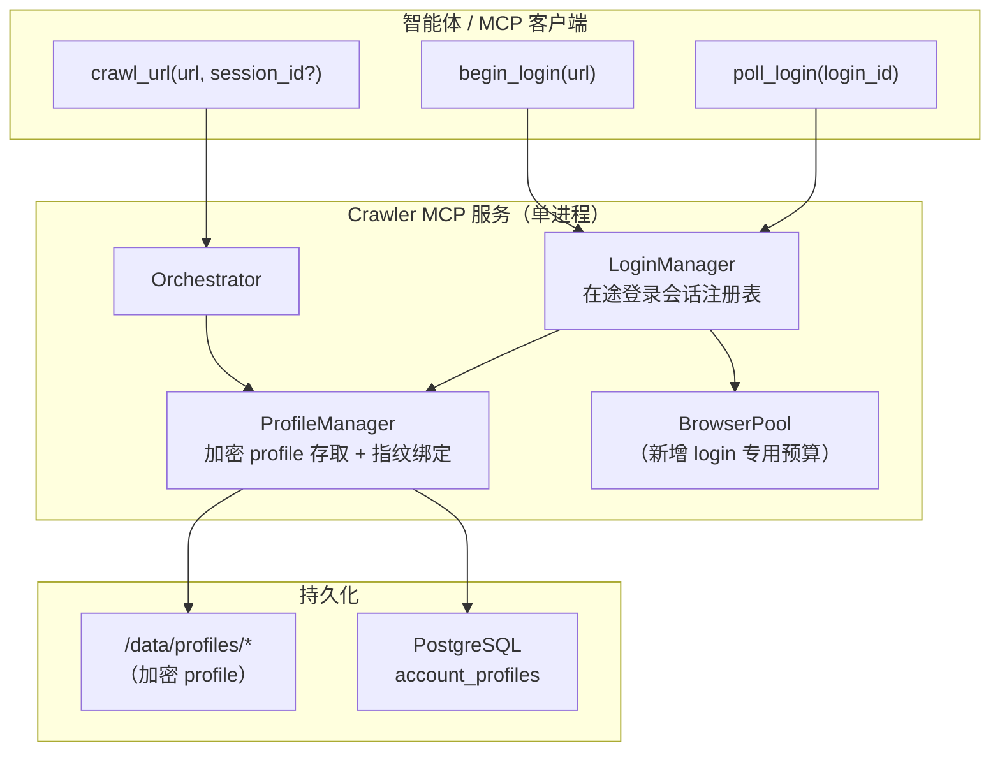
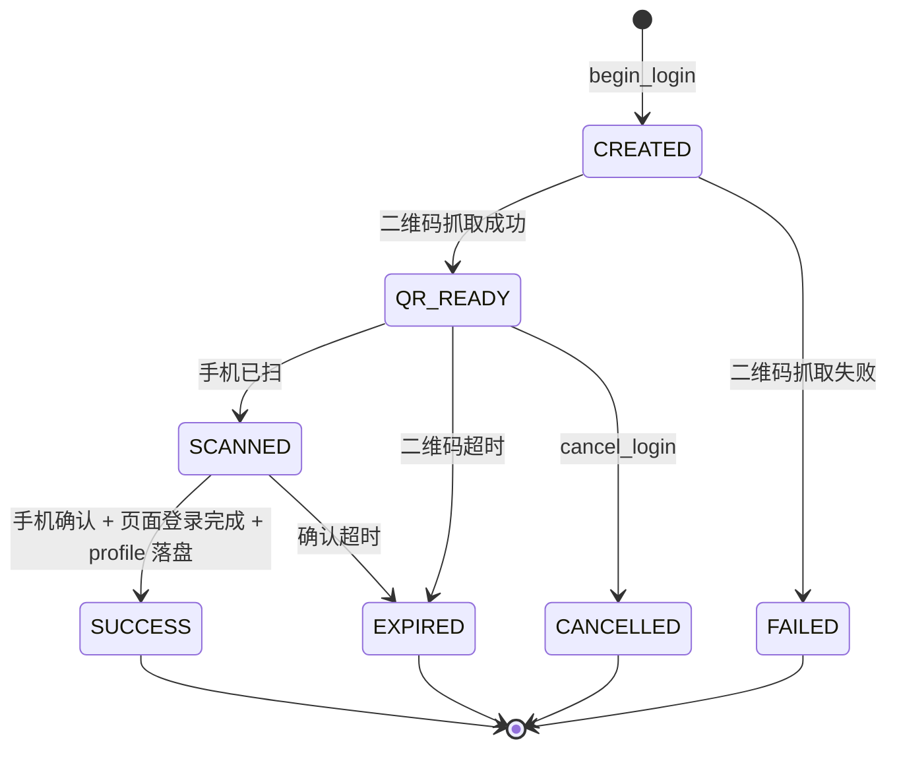

# Hermes 爬虫 MCP — Phase 3 设计：持久化设备指纹与扫码登录态

> 本文档是 [`hermes-crawler-mcp-technical-design.md`](./hermes-crawler-mcp-technical-design.md) 的 Phase 3（第三阶段「增强能力」，见主文档 §19）详细设计，聚焦两项能力：
> 1. **持久化浏览器 profile**（设备指纹 + Cookie 捆绑落盘、加密存储）；
> 2. **扫码登录交互流**（对京东/淘宝等登录墙返回状态码 + 二维码，用户在聊天窗扫码登录，登录态持久化复用）。
>
> 本文档只做设计与决策梳理，**不含实现**。落地前需用户先拍板 §9 中的决策项（尤其加密方案与 ToS/合规取舍）。

---

## 1. 目标与范围

### 1.1 目标

- 对需要登录才能访问的页面（京东商品页跳 `passport.jd.com`、淘宝跳登录等），不再直接返回 `BLOCKED`，而是引导用户**扫码登录一次**，之后**长期复用登录态**继续抓取。
- 通过**持久化设备指纹 + Cookie**，降低风控拦截概率，并保证登录会话在多次抓取间不被风控判定为「环境变更」而失效。

### 1.2 非目标（本期不做）

- 不做账号密码/短信验证码登录，只做**扫码登录**（安全面最小、最贴合京东/淘宝主流方式）。
- 不做账号池、多账号轮换调度（留待后续）。
- 不接受调用方直接传入原始 Cookie（延续主文档 §14.4 原则）。

### 1.3 与现有代码的衔接（已预埋的口子）

| 已有 | 位置 | Phase 3 如何用 |
|---|---|---|
| `session` 参数贯穿抓取链 | `orchestrator.crawl` / `*_fetch`（主文档 §7.4） | 承载 profile/登录态上下文，无需再改调用链 |
| 登录跳转检测 | `detector` → `login_redirect` → `LOGIN_REQUIRED`/`LOGIN_WALL`（§4.3） | 作为「需要登录」的触发信号 |
| `cache_key` 保留 `session_id` 槽位 | `app/storage/cache.py` | 登录态抓取结果按会话独立缓存 |
| Cookie/登录态安全原则 | 主文档 §14.4 | 本文档 §8 将其细化为可实施方案 |
| 域名白名单（preferred_mode） | `crawl_domain_rules`（Phase 2 已实现） | 扩列关联登录 profile |

---

## 2. 为什么指纹与 Cookie 必须捆绑

京东/淘宝风控会把**登录会话绑定到登录当时的设备指纹**（UA、Canvas/WebGL、字体、屏幕、时区、navigator 等）。

- 若用指纹 A 扫码登录得到 Cookie，之后用指纹 B（下次新启动的浏览器，指纹重新生成）携带该 Cookie 请求，风控大概率判定「环境变更」→ 要求重新验证或直接失效。
- 因此**登录 Cookie 与「生成它的那套指纹」必须作为一个整体一起持久化、一起加载**。

**结论**：持久化 profile（`user_data_dir` + 固定指纹）不是可选优化，而是登录态复用的地基。本文档把两者统一为一个概念——**Profile**。

---

## 3. 总体设计



两大子系统：

- **ProfileManager（Part A，§4）**：持久化指纹 + Cookie 的加解密、加载、隔离、并发约束。抓取路径与登录路径都依赖它。
- **LoginManager（Part B，§5）**：扫码登录的两阶段交互、在途会话状态机、二维码抓取、登录成功落盘。

---

## 4. Part A — 持久化浏览器 Profile

### 4.1 Profile 模型

一个 Profile = 一个可复用的「虚拟设备 + 其登录态」，由 `session_id` 唯一标识：

```
Profile
├── session_id       主键（= 主文档 §14.4 的服务端 session_id）
├── domain           归属域名（如 www.jd.com），按域名隔离
├── label            人类可读名（如 "jd-主账号"）
├── fingerprint      固定指纹配置（seed / 具体参数 JSON）
├── user_data_dir    浏览器持久上下文目录（含 cookie/localStorage）
├── status           ACTIVE / EXPIRED / REVOKED
├── created_at / last_used_at / expires_at
```

### 4.2 磁盘布局与加密（关键决策项，见 §9）

只读根文件系统 + 仅 `/data` 可写（主文档 §14.2）。Cookie 是**等同凭据的高价值密钥**，**明文落盘不可接受**。设计方案：

```
/data/profiles/<session_id>.enc     # AES-256-GCM 加密的 profile 压缩包
```

**加载/使用流程（明文只存在于内存态 tmpfs，绝不落盘为明文）**：

1. 加载：从 `/data/profiles/<id>.enc` 读密文 → 用主密钥解密 → 解包到 **`/tmp`（tmpfs，内存支撑）** 下的临时 `user_data_dir`。
2. 使用：浏览器以该 tmpfs 目录为持久上下文启动、抓取/登录。
3. 回写：会话结束（或 cookie 变更）时，把 tmpfs 目录重新打包加密 → 原子写回 `/data/profiles/<id>.enc`。
4. 清理：删除 tmpfs 明文副本。

这个方案天然契合现有「只读 rootfs + tmpfs `/tmp`」的容器加固。

#### 4.2.1 密钥管理（本期定案：环境注入，轮换外部管理）

本期**不引入 KMS**，按最小闭环实现。密钥管理面临一个**不可能三角**，无 KMS 时三者只能取二：

| | 诉求 |
|---|---|
| (a) | 不依赖外部系统（无 KMS）——本期约束 |
| (b) | 密钥不持久、不落在容器可及处——最安全 |
| (c) | 重启后自动解密、登录态存活——**功能的核心承诺** |

- 「启动时动态生成临时密钥」保 (a)(b) 但牺牲 (c) → **每次重启即丢登录态、需重新扫码**，与功能目标冲突，故不采用。
- 本期选择**保 (a)(c)、让步 (b)**。

**定案**：主密钥 `PROFILE_ENCRYPTION_KEY` **从部署环境注入**（docker secret / 编排 env / 不提交的 `.env`），并满足：

- **不进镜像、不进日志、不进 Git、不进 `/data` 卷**——密钥与密文分离。
- **排除出 `/data` 的备份范围**：日常备份的是 `/data`（cookie 密文所在），密钥走独立通道，确保「备份被翻」这一最常见泄漏路径拿不到明文。
- 重启由编排重新注入同一密钥 → 存量 profile 可继续解密，登录态存活。

**轮换：由外部管理**（本服务不内建轮换命令）。运维在外部替换 `PROFILE_ENCRYPTION_KEY` 并完成存量 profile 的「旧密钥解 → 新密钥重新加密」迁移；服务侧仅消费当前注入的密钥。

**诚实的安全边界（务必知悉）**：

- ✅ 防住：**密文脱离运行进程独立泄漏**——卷备份/快照、报废盘、误挂载/`docker cp`、镜像泄漏。这是本期加密的真实价值。
- ❌ 不防：**容器运行时被攻破**（攻击者读环境变量即得密钥），以及**容器 + 卷被同时拿到**。at-rest 加密本就不解决活进程被打穿——这类威胁靠下列不依赖密钥保密的控制来兜底。

**配套控制（不依赖密钥保密，用于兜底运行时威胁，收敛被盗登录态的价值）**：

1. **短 cookie TTL + 定期重登 + 可主动登出撤销** → 明文即便被拿走也快速失效。
2. **容器加固**（已有：只读 rootfs、`cap_drop ALL`、`no-new-privileges`、非 root）→ 降低被打穿概率。
3. **`/data` 卷访问最小化** → 限制无关容器/人挂载或拷贝。

**未来接入项**：具备条件后升级为**外部 KMS + 信封加密**（主密钥留在 KMS/HSM、每次解密可审计/可撤销/可限流），把「偷一次密钥永久离线解全部」收敛为「有限、可观测、可撤销的在线窗口」。见 §9 D2。

### 4.3 指纹固定

- 首次创建 profile 时生成一套指纹配置并**持久化到 profile**；之后每次启动浏览器都**注入同一套指纹**，保证跨会话一致。
- **Spike 待确认**：Scrapling 的 `AsyncStealthySession` / `AsyncDynamicSession` 对 `user_data_dir` 与指纹注入的透传方式（是否需绕过封装直接使用底层 Camoufox/Playwright 的 `launch_persistent_context` 与指纹参数）。此为 Part A 的首个技术验证项。

### 4.4 并发约束（重要）

**一个 `user_data_dir` 是单写的**——不能被多个并行浏览器上下文同时打开，否则 profile 损坏。因此：

- 每个 profile 同一时刻**至多一个活跃浏览器上下文**；同一 `session_id` 的抓取请求**串行化**（每 profile 一把锁）。
- 现有 `BrowserPool` 的 `max_browser_pages` 页池模型面向「无状态并发抓取」，不适用于 profile；Phase 3 需引入 **ProfileManager 级别的 per-profile 锁 + 一个受限的 profile 会话预算**（例如同时最多 N 个不同 profile 活跃），与无状态抓取的并发预算**分开计**。

### 4.5 浏览器重启豁免

现有 `BrowserPool` 每 100 任务 `close()/start()` 回收（主文档 §8）。该盲目重启会：

- 杀掉**在途登录页**（正在等扫码）→ 必须豁免。
- 关闭 profile 上下文 → profile 本身在磁盘（`user_data_dir`），重启后可重新加载，但**在途会话**丢失。

设计：登录/持久 profile 的浏览器上下文**不纳入** 100 任务盲重启；其生命周期由 ProfileManager / LoginManager 显式管理（用完即关、或按空闲 TTL 回收）。

---

## 5. Part B — 扫码登录交互流

### 5.1 为什么必须两阶段

MCP 工具是**一问一答**；而扫码登录是**几十秒的异步过程**（展示二维码 → 用户掏手机 → 扫码 → 手机确认 → 页面轮询到成功）。若塞进单次 `crawl_url`，会把一个浏览器页 + MCP 连接**阻塞几十秒**，与现有「非阻塞并发闸门（满则 `RATE_LIMITED`）」冲突。

因此拆成两个工具 + 服务端保持登录页存活：

### 5.2 新增 MCP 工具

#### `begin_login`

```jsonc
// 入参
{ "url": "https://www.jd.com/...", "site": "jd" }   // site 可选，缺省按域名推断
// 出参（成功）
{
  "status": "LOGIN_REQUIRED",
  "login_id": "lg_ab12...",
  "qr_png_base64": "iVBORw0KGgo...",   // 二维码图片，供智能体在聊天窗渲染
  "expires_at": "2026-07-20T09:00:00Z",
  "poll_interval_seconds": 3
}
```

行为：ProfileManager 分配（或新建）该域名的 profile → 用其持久上下文的 L3 浏览器打开登录页 → 定位二维码元素 → 截图为 PNG → base64 返回；浏览器页**保持存活**，按 `login_id` 挂入 LoginManager 注册表。

#### `poll_login`

```jsonc
// 入参
{ "login_id": "lg_ab12..." }
// 出参
{ "status": "PENDING" }                                  // 尚未扫码/未确认
{ "status": "SCANNED" }                                  // 手机已扫，待确认
{ "status": "SUCCESS", "session_id": "jd-user-001" }     // 登录成功，profile 已落盘
{ "status": "EXPIRED" }                                  // 二维码/会话超时
{ "status": "FAILED", "message": "..." }
```

行为：查询该 `login_id` 对应登录页的状态；`SUCCESS` 时登录 Cookie 已写入 profile 并加密落盘，返回可用于后续 `crawl_url` 的 `session_id`。

#### `cancel_login`（可选）

主动放弃登录，关闭挂起的浏览器页、释放资源。

### 5.3 在途登录会话状态机（LoginManager）



- 注册表为**进程内内存态**（键 `login_id` → 活跃浏览器页 + 状态），因为它绑定一个活的浏览器页；辅以最小审计记录入库。
- 每个在途会话有**硬 TTL**（如 180s），超时自动 `EXPIRED` 并回收浏览器页，防止资源泄漏。

### 5.4 二维码抓取与登录成功检测（站点适配层）

京东、淘宝的二维码 DOM 位置与「扫码成功」信号各不相同，抽象为**站点适配器**接口：

```python
class LoginAdapter(Protocol):
    domain_patterns: tuple[str, ...]
    async def open_login(self, page) -> None: ...
    async def capture_qr(self, page) -> bytes: ...        # 返回二维码 PNG 字节
    async def poll_status(self, page) -> LoginStatus: ...  # PENDING/SCANNED/SUCCESS/EXPIRED
    async def confirm_logged_in(self, page) -> bool: ...   # 落盘前最终确认
```

- 内置 `JdLoginAdapter`、`TaobaoLoginAdapter`；新增站点只加一个适配器，不动主流程。
- 二维码优先**截取元素区域**（而非整页），减小体积、避免泄漏无关内容。

### 5.5 与 `crawl_url` 的衔接

登录后：

- `crawl_url` 传 `session_id`（主文档 §14.4 既定形态）→ Orchestrator 经 ProfileManager 加载对应 profile → 用已登录上下文抓取。
- `crawl_domain_rules` 增列 `default_session_id`（可空）：白名单域名可默认关联某 profile，`mode=auto` 时自动带登录态，无需每次显式传 `session_id`。

---

## 6. 数据模型变更

### 6.1 新表 `account_profiles`

| 列 | 类型 | 说明 |
|---|---|---|
| session_id | TEXT PK | profile 标识（= §14.4 session_id） |
| domain | TEXT | 归属域名 |
| label | TEXT | 人类可读名 |
| status | TEXT | ACTIVE / EXPIRED / REVOKED |
| fingerprint_id | TEXT | 指纹配置引用（配置本身随加密 profile 落盘，库中不存指纹明细） |
| created_at / last_used_at / expires_at | TIMESTAMPTZ | 生命周期 |

> **库中绝不存 Cookie 或指纹明文**；密文与明细只在 `/data/profiles/<id>.enc`。库表仅存元数据与索引。

### 6.2 `crawl_domain_rules` 扩列

- `default_session_id TEXT NULL`：域名默认关联的 profile。

### 6.3 在途登录会话

进程内内存态为主；可选 `login_audit`（login_id、domain、status、时间戳）用于审计，**不存二维码、不存 cookie**。

---

## 7. 错误码与状态扩展

### 7.1 错误码（扩展主文档 §4.3）

| error_code | 场景 |
|---|---|
| `LOGIN_REQUIRED`（已有语义强化） | 命中登录墙，应走 `begin_login` |
| `LOGIN_INIT_FAILED` | 打开登录页/抓二维码失败 |
| `LOGIN_EXPIRED` | 二维码或登录会话超时 |
| `SESSION_NOT_FOUND` | `crawl_url` 传入的 `session_id` 不存在/已吊销 |
| `SESSION_EXPIRED` | profile 登录态失效，需重新登录 |
| `PROFILE_DECRYPT_FAILED` | 主密钥错误或密文损坏 |

### 7.2 状态模型（扩展主文档 §5）

登录会话状态见 §5.3；抓取侧新增「命中 `SESSION_EXPIRED` → 提示重新登录」的分支。

---

## 8. 安全设计（强化主文档 §14.4）

> 本节多条为**必须由用户拍板的决策项**，见 §9。

1. **Cookie = 凭据级密钥**：静态加密（§4.2），明文仅存在于内存态 tmpfs，绝不明文落盘、绝不进日志/Markdown/工具回显。
2. **脱敏覆盖**：现有 `redaction` 层需扩展，确保 `session_id` 关联的 cookie、二维码 base64、profile 路径等不出现在任何日志/指标/错误信息中。
3. **主密钥管理**：环境注入、可轮换、与业务库权限分离；密钥泄漏等价于账号泄漏。
4. **TTL 与轮换**：profile 设过期时间；长期不用自动失效；支持主动 `REVOKE`（登出并删除密文）。
5. **身份与多租户**：服务从「匿名无状态」变为「持有用户登录态」。需明确 profile 归属与访问控制——**谁能用某个 `session_id`**？（当前无鉴权，见 §9 决策）。
6. **注入边界不变**：即便登录态下抓取，页面内容**仍是不可信外部数据**，`untrusted_external_content: true` 照常标注（主文档 §14.3）。
7. **二维码来源可信性**：二维码由服务端从**目标官方登录页**实时截取，不接受外部传入图片，避免二维码钓鱼/替换。
8. **ToS / 法律合规**：自动化登录抓取京东/淘宝**大概率违反其用户协议**，可能导致账号封禁乃至法律风险。是否启用、由谁承担，属于业务决策，本设计不替代该判断。

---

## 9. 需用户决策的开放项

| # | 决策项 | 选项/影响 |
|---|---|---|
| D1 | **是否启用登录抓取** | **已授权**（用户于 2026-07-21 明确授权推进；ToS/合规风险与责任由用户承担，见 §8.8）。3b 门禁解除，仍需完成 S2/S4 技术验证 |
| D2 | **加密主密钥来源** | **已定案**：本期环境注入 `PROFILE_ENCRYPTION_KEY`（与 `/data` 分离、排除备份范围），**轮换由外部管理**；KMS + 信封加密列为未来接入项。详见 §4.2.1 |
| D3 | **是否引入访问鉴权** | 现服务无鉴权；持有登录态后是否需要区分「谁能用某 session」 |
| D4 | **横向扩容取舍** | 在途登录页存于单进程内存 → 多副本需按 `login_id` 会话亲和路由，或**登录流限单节点**；profile 抓取可共享 `/data`（需共享存储）后再多副本 |
| D5 | **首批支持站点** | 仅京东？含淘宝？决定适配器工作量与验证成本 |
| D6 | **profile 生命周期策略** | 过期时长、闲置回收、并发 profile 上限 N |

---

## 10. 并发与横向扩容影响

- 登录流与 profile 抓取是**有状态**的，打破了一期「无状态、单机自闭环」的假设（主文档 §1、§20）。
- **单机**：完全可行，无额外依赖。
- **多副本**：需要 (a) 登录 `login_id` 的会话亲和路由（回到持有浏览器页的副本），(b) profile 密文改共享存储（对象存储/NFS）并处理跨副本的 per-profile 单写锁（分布式锁）。建议 Phase 3 先坐实**单节点**，多副本作为更后续项。

---

## 11. 可观测性

新增指标（延续主文档 §17 风格，注意脱敏）：

- `login_begin_total` / `login_success_total` / `login_expired_total` / `login_failed_total`
- `active_login_sessions`（在途登录页数）
- `active_profiles`（活跃 profile 上下文数）
- `profile_load_seconds` / `profile_decrypt_failed_total`
- `crawl_with_session_total`（带登录态抓取次数）

---

## 12. 测试与验收（TDD，按可自闭环模块）

延续主文档 §18 与既有 TDD 实践，拆分为可独立交付的模块：

| 模块 | 单测（无浏览器/无 PG） | 集成测（真实浏览器/PG） |
|---|---|---|
| M-P3-1 加密存取 | 加解密往返、密钥错误、密文损坏 → `PROFILE_DECRYPT_FAILED`；明文只落 tmpfs | 真实文件读写、原子回写 |
| M-P3-2 ProfileManager | per-profile 锁、并发预算、加载/回收；重启豁免逻辑 | 真实持久上下文加载、指纹一致性 |
| M-P3-3 LoginManager 状态机 | 状态迁移、TTL 过期、cancel（用 fake page） | — |
| M-P3-4 站点适配器 | 适配器接口契约（fake page） | 京东/淘宝真实登录页二维码抓取、成功检测（人工/半自动） |
| M-P3-5 MCP 工具 | `begin_login`/`poll_login` 出入参、错误封装（注入 fake 子系统） | 端到端两阶段流 |
| M-P3-6 crawl_url 衔接 | `session_id` 解析、`SESSION_NOT_FOUND`/`SESSION_EXPIRED` | 登录态下真实抓取 |

**验收要点**：明文 cookie 永不落 `/data`、永不进日志；扫码成功后重启服务仍能用持久登录态抓取；指纹跨会话一致。

---

## 13. 分期实施建议

1. **Phase 3a — 持久 profile（Part A）**：先做加密存取 + ProfileManager + 指纹固定 + 并发/重启约束。**不涉及登录**，即可用「稳定指纹 + 暖 cookie」小幅降拦截，风险可控，且是登录的地基。
2. **Phase 3b — 扫码登录（Part B）**：在 3a 之上加 LoginManager + 两阶段工具 + 站点适配器。需先通过 §9 决策（尤其 D1 合规、D2 密钥）。
3. **Phase 3c — 站点扩展 / 多副本**：更多站点适配器；有状态多副本方案（§10）。

---

## 14. 首个技术验证（Spike）清单

落地前应先验证：

- S1：Scrapling 会话对 `user_data_dir` 持久上下文与指纹注入的透传方式（§4.3）。
- S2：京东扫码登录页的二维码 DOM 定位与「扫码/确认/成功」轮询信号（§5.4）。
- S3：只读 rootfs + tmpfs 下，浏览器以 tmpfs `user_data_dir` 启动、退出时加密回写 `/data` 的完整链路（§4.2）。
- S4：登录成功后 cookie + 指纹重载，能否稳定通过京东风控继续抓取（验证 §2 的捆绑假设）。

### 14.1 Spike 结果

- **S1 ✅**（A3 已验证）：`AsyncStealthySession(user_data_dir=...)` 默认走
  `launch_persistent_context`，cookie/localStorage 落 `user_data_dir`；指纹稳定靠固定目录 +
  钉住 `timezone_id`/`locale` 等（无 Camoufox 式指纹种子）。
- **S3 ✅**（A3 集成测已验证）：持久 cookie 经「浏览器→加密落 `/data`→解密重载」仍随请求发出。
- **S2 部分 ✅**（登录页可正常打开，status 200，未被反爬拦）：
  - 登录页：`https://passport.jd.com/new/login.aspx`。
  - **二维码元素**：`">`
    —— 真实 ``（非 canvas）。`capture_qr` 可**截该元素**或取其 src 图片字节。
  - 容器：`.qrcode-img-warp` / `.qrcode-img`；**过期标记**：`#J-qrcoderror`（class 含 `hide`，
    过期时去掉 `hide`）。
  - **状态轮询**：JD 在压缩 JS 内轮询 `qr.m.jd.com/check`，token 走 `wlfstk_smdl` cookie；
    静态 HTML 取不到。按 JD 公开 QR 协议：`code=201` 未扫、`200` 成功（返回 `ticket`，再
    `passport.jd.com/uc/qrCodeTicketValidation?t=<ticket>` 换登录 cookie）、`203` 失效。
  - **适配器实现取向（DOM 观察式，推荐）**：让 JD 页自身 JS 跑轮询，`poll_status` 观察
    DOM/URL —— 成功=已跳离登录页/出现登录态、过期=`#J-qrcoderror` 去 `hide`、否则 PENDING。
    需要一个**活的登录页**持续跑 JD 轮询 JS（即 ProfileManager「开/持有/关」扩展）。
  - **待验（需真机扫码，属 S4）**：SCANNED/SUCCESS 的确切 DOM/URL 迁移。
- **S4 ⏳**：需真人扫码 + 重启复用验收，未做。

---

## 15. 开发计划（TDD，按可自闭环模块）

延续 M0–M10 的做法：**每个里程碑先写失败测试（RED）→ 最小实现（GREEN）→ 重构**，独立可交付、单独 commit 且全绿。**默认单测不依赖真实浏览器/PG**（用 fake 注入），真实浏览器/PG 仅进 `browser`/集成测试。测试模块编号沿用 §12 的 M-P3-*。

### 15.0 前置 Spike（写代码前先 de-risk，不产出生产代码）

| Spike | 验证 | 门禁的里程碑 | 产出 |
|---|---|---|---|
| S1 | Scrapling 透传 `user_data_dir` + 指纹注入的方式 | M-P3-2 | 一段可跑的最小示例 + 结论记录 |
| S3 | 只读 rootfs + tmpfs 下「解密到 tmpfs→浏览器启动→加密回写 `/data`」闭环 | M-P3-1/2 | 手工验证脚本 |
| S2 | 京东登录页二维码 DOM 定位与扫码/确认/成功轮询信号 | M-P3-4（3b） | 选择器与信号清单 |
| S4 | 登录态（cookie+指纹）重载后能否稳定过京东风控 | 3b 验收 | 验证 §2 捆绑假设成立与否 |

> S1/S3 通过后才动 3a；S2/S4 与 D1（合规授权）通过后才动 3b。

### 15.1 Phase 3a — 持久 Profile（不涉及登录，可独立上线降拦截）

**里程碑 A1 — 配置与数据模型**（依赖：无）
- RED：`Settings` 新增 `profile_encryption_key` / `profiles_dir` / `profile_ttl_seconds` / `max_active_profiles` 的加载与校验测试；`account_profiles` 表的 `upsert/get/list/revoke/touch_last_used` 的 PG 集成测试（仿 `test_database.py`）。
- GREEN：扩 `config.py`；新增 migration `0002_account_profiles.sql`；`Database` 加对应方法。
- 自闭环验收：迁移可应用、CRUD 往返正确。

**里程碑 A2 — 加密存取（M-P3-1）**（依赖：A1、S3）
- RED（纯单测，无浏览器/PG）：
  - 加解密往返：打包目录 → 加密 → 解密 → 内容一致；
  - 错误密钥 / 密文损坏 → `PROFILE_DECRYPT_FAILED`；
  - 明文只落 tmpfs 路径、`/data` 下只有 `.enc`；
  - 回写为**原子**（临时文件 + rename）。
- GREEN：`app/storage/profile_store.py`（AES-256-GCM；`load_to_tmpfs` / `seal_from_tmpfs`）。
- 自闭环验收：任何路径下 `/data` 不出现明文。

**里程碑 A3 — ProfileManager（M-P3-2）**（依赖：A2、S1）
- RED（单测，fake 浏览器工厂 + fake store）：
  - 同一 `session_id` 并发请求被 **per-profile 锁串行化**；
  - 活跃 profile 数达 `max_active_profiles` → 新请求排队/拒绝（明确语义）；
  - 加载→使用→空闲 TTL 回收；
  - **重启豁免**：盲重启周期不作用于 profile 上下文。
- GREEN：`app/crawler/profile_manager.py`（per-profile `asyncio.Lock`、受限会话预算、生命周期）。
- 集成（`browser`）：真实持久上下文加载 + **指纹跨两次会话一致**（读取浏览器指纹标记比对）。
- 自闭环验收：建 profile→抓取→释放，指纹稳定、无 profile 损坏。

**里程碑 A4 — crawl_url 衔接 session（M-P3-6a）**（依赖：A3）
- RED（单测，fake ProfileManager）：
  - `crawl_url(session_id=...)` → Orchestrator 经 ProfileManager 取 profile 并把 `session` 传入抓取链（`session` 参数已预留，见 §7.4）；
  - 未知/已吊销 `session_id` → `SESSION_NOT_FOUND`；登录态失效 → `SESSION_EXPIRED`；
  - `crawl_domain_rules.default_session_id` 生效：白名单域名 auto 自动带 profile。
- GREEN：Orchestrator 注入 ProfileManager；`crawl_domain_rules` 加列 `default_session_id`（migration + admin CLI `--session-id` 选项）。
- **3a 端到端验收**：创建 profile → 带 `session_id` 抓某公开站 → **重启容器** → 再抓复用持久 profile；确认 `/data` 无明文、指纹一致。

### 15.2 Phase 3b — 扫码登录（门禁：D1 合规授权 + S2/S4）

**里程碑 B1 — LoginManager 状态机（M-P3-3）**（依赖：A3）
- RED（单测，fake page/adapter）：`CREATED→QR_READY→SCANNED→SUCCESS` 全迁移、二维码/确认超时→`EXPIRED`、`cancel`→`CANCELLED`、TTL 到期自动回收、注册表按 `login_id` 隔离。
- GREEN：`app/crawler/login_manager.py`（内存注册表 + 硬 TTL + 回收）。

**里程碑 B2 — 站点适配器（M-P3-4）**（依赖：B1、S2）
- RED（单测，fake page）：`LoginAdapter` 契约测试；`JdLoginAdapter` 的选择器/信号解析用**离线 HTML 夹具**驱动。
- GREEN：`app/crawler/login_adapters/{base,jd}.py`。
- 集成（`browser`，半人工）：真实京东登录页抓二维码 + 轮询成功。

**里程碑 B3 — MCP 工具（M-P3-5）**（依赖：B1、B2）
- RED（单测，注入 fake LoginManager）：`begin_login`/`poll_login`/`cancel_login` 出入参 schema、各状态返回、错误封装（`LOGIN_INIT_FAILED` 等）；二维码以 base64 返回。
- GREEN：在 `app/main.py` 注册三个工具 + `app/tools/login.py` 实现层。
- 集成：走真实 MCP 协议的两阶段端到端（`begin_login`→人工扫→`poll_login=SUCCESS`）。

**里程碑 B4 — 安全兜底测试**（贯穿 B1–B3）
- RED：**脱敏回归**——cookie、二维码 base64、profile 路径、`PROFILE_ENCRYPTION_KEY` 绝不出现在日志/指标/错误信息（扩展 `redaction` 测试）；登录态抓取的 Markdown 仍带 `untrusted_external_content: true`。
- **3b 端到端验收（含 S4）**：扫码一次 → **重启服务** → 用持久登录态抓一个登录墙页面成功；全程 `/data` 无明文、日志无敏感。

### 15.3 Phase 3c —（后续，非本期承诺）
更多站点适配器（淘宝等）；有状态多副本（会话亲和路由 + 共享存储 + 分布式 per-profile 锁，见 §10）。

### 15.4 里程碑依赖与交付顺序

```
S1,S3 ─▶ A1 ─▶ A2 ─▶ A3 ─▶ A4 ─▶【3a 上线】
                         │
                D1,S2,S4 ▼
                        B1 ─▶ B2 ─▶ B3 ─▶ B4 ─▶【3b 上线】
```

- **3a（A1–A4）不依赖登录决策**，可先独立交付，立即获得「稳定指纹 + 持久 cookie」的降拦截收益，且是 3b 的地基。
- **3b（B1–B4）动工前必须先拿到 D1（合规授权）**，并完成 S2/S4。
- 每个里程碑一个绿色 commit；单测保持不依赖真实浏览器/PG，集成/`browser` 测试单独跑。
